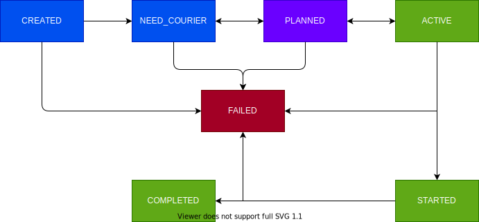

# Introduction

Barbora Express API (further referred as API) is intended for use by merchants who want to use Barbora Express as a last mile carrier partner for their deliveries.
For more info, get in touch: kristupas.pajeda@barboraexpress.lt

### Order creation process

Order can be created via Self Service dashboard or API.

### Order lifecycle

Order may have following states during its lifecycle:

Some order states are relevant only to internal processing. States that are relevant to API users:

1. CREATED - indicates that order has been created and registered in Barbora Express database.
2. ACTIVE - indicates that courier, who has been assigned to fulfill it, has started pickup route.
3. STARTED - indicates that courier has picked the order and has started delivery route.
4. COMPLETED - indicates that order has been fulfilled.
5. FAILED - indicates that order's delivery has failed or order has been cancelled.

### Order tracking

At any given point customer can track current order status and location.
Customer will receive SMS message with tracking link when order status becomes `ACTIVE` and another message informing that courier has collected order and started delivery.

### Webhooks

On every status change webhook may be set to merchant api endpoint. This allows merchants to track order in their internal systems.

### Order delivery pricing

Order price is calculated on order creation and will be finalized on terminal state `COMPLETED` | `FAILED`.
