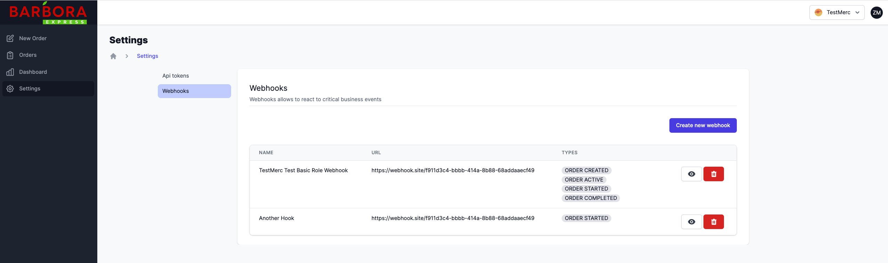

# Webhooks

Webhooks are designed to inform merchant about order status changes.

Webhook should return status 200 for successful consumption. If webhook failed to be delivered (calling webhook returned `400-599`), it will be tried calling again after 5 minutes and repeated until 100 failures, then after 12 hours break will be retried again.
If webhook fails 300 times, it will stop trying.

# Webhook types

1. Order status
  * Created
  * Active
  * Started
  * Completed
  * Failed

## Creating webhooks

Webhooks can be created via Self Service `Settings` page:



## Webhook payload

Webhook JSON schema:

[V1.OrderWebhook](https://barbora-express.github.io/webhooks/schemas/v1.order-status.json)

Webhook payload types are described in [`@barbora-express/webhooks`]() npm package, using this package is one of the options to process webhooks like so:

You can generate JSON Schema for any type system using [app.quicktype.io](https://app.quicktype.io/)

```typescript
import { V1 } from `@barbora-express/webhooks`

function consumeWebhook(webhook: V1.OrderWebhook) {}
```
## Webhook verification

Each webhook will have `x-verification-code` header. 

This is webhook payload sha256 hash encrypted with barbora-express private key (**ONLY we know this key**).

To validate this verification code you need to decrypt using [public key](https://barbora-express.github.io/public.key) hash webhook payload and compare with decrypted result.


```javascript
const crypto = require("crypto");

const public = `-----BEGIN RSA PUBLIC KEY-----
MIIBCgKCAQEAzcOUQXxAUGdcyziNNkRgkOgm3b6F5Czm7nvKGcGNcEi9dzmFXXKe
raRmqOH5LokFPprAEBu8KQuoy4sQMP+xAktgen3O4MnRLfn13BqqgvpFuHESKdcG
K7ijTN4k5+uM1qSYnUu024A6m5uP+uCIASAlR5NqUNsWrElCZhAnG0gkVsnwuAi/
x6nxx11cfrHBhtfuA+tNk4dTbUq1l6AbTQEz/xLJtqdvioSAngBpjXGZd22JqlP0
mAFmbWrUFS72fs9pCFZX+8xOKsq8/AslvOtLGxhrHYgAkjOe6k8H0SJxJa+gZBXg
WSYvnFRZ6sc6A6wWES6KU9V/j7+z1OnxWwIDAQAB
-----END RSA PUBLIC KEY-----`;

const result = crypto
  .publicDecrypt(
    public,
    Buffer.from(
      "DyhpL/fzmvIVZLpZtpYIj7WWxbFV+BUmW6Sjyl/Xkrni7v0dtNB2AoCDmcDikOZrAlqroTngwm2PsoW3rW5JjUg53m5G3TgjV6QAI/XX98kuhcRaTkvtwFW0EXomJeMgTmbs83Hp9sLTyjVkHaZVUkCJZ7dQZ3uF/9HPH6jPb2QLcNWtKuMizoKy5t/yQ07cNXF5OyQBFFm3bvARA+wPo0GTX8Pz4ebFe0NvMmq5f1+k34eMfhIydjXZr3qcydK21QaFKQxtO0aumbNhhyVdcXvvV1S50nmaPdnWruByC+f0RX5THmIma7E+bH6e1Ihgurw2Hl5uvTKI0H5Zn5ZCgg==",
      "base64"
    )
  )
  .toString();
console.log(result);
```