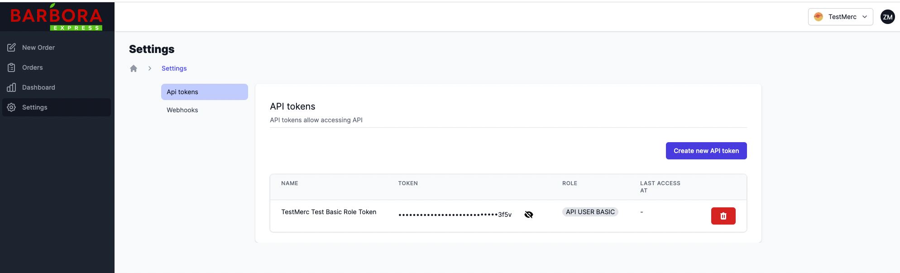

# Creating your first order

## Prerequisites

- You have created an account in Self Service Web App.
- Your account is approved by BarboraExpress Team
- You have access API token.

API tokens can be created via Self Service `Settings` page:



## Environments

| # | PRODUCTION | TESTING |
| API GRAPHQL | https://ha.barboraexpress.com/v1/graphql | https://ha.barbora-go.co/v1/graphql |
| API REST | https://ha.barboraexpress.com/api/rest/order POST | https://ha.barbora-go.co/api/rest/order POST |
| WS | wss://ha.barboraexpress.com/v1/graphql | wss://ha.barbora-go.co/v1/graphql |
| SELF SERVICE | https://dashboard.barboraexpress.lt | https://barbora-express-sandbox-stag.web.app |
| TRACKING PAGE | https://tracking.barboraexpress.lt | https://barbora-express-tracking-stag.web.app |

Use same user login credentials for production and testing environments in Self Service. Organizations in testing and production are separate entities.
First time logging into testing environment you will be asked to create new organization that will be used for testing purposes. Please note that there are no actual couriers in testing environment, but order lifecycle can be simulated by Barbora Express team, please contact your sales representative to arrange that.

> Only login credentials are shared across multiple environments

## Request Headers

| Header        | Value               |
|---------------|---------------------|
| content-type  | application/json    |
| authorization | Token xxxxx         |

To reach web sockets use `wss` instead of `https`

## Executing basic request

To create order execute this graphql query via graphql endpoint

```graphql
mutation CreateOrder($data: OrdersServiceOrderCreateObject!) {
  createOrder(data: $data)
}
```

with variables

```json
{
  "data": {
    "orderId": "123456789A",  //  string, unique, required, min 10 length
    "shortId": "1wqw2",   // string, required, min 4, max 8
    "startAfter": "2022-11-17T17:17:17.000Z",  // Date, required
    "pickup": {
      "address": {
        "address": "Ozo g. 25, Vilnius, Lithuania",  // string, either address, or both coordinates are required 
        "coordinates": {
          "lat": 54.70884,  // number, either address, or both coordinates are required
          "lng": 25.26044   // number, either address, or both coordinates are required
        },
        "contactName": "Your pickup address contact name",  // string, required
        "contactPhone": "+370XXXXXXXX",  // string with E.164 phone format +[country_code][area_code][phone_number], required
        "notes": "pickup notes"
      }
    },
    "dropOff": {
      "address": {
        "address": "Gedimino pr. 5, Vilnius, Lithuania",  // string, either address, or coordinates are required
        "coordinates": {
          "lat": 54.69921,  // number, either address, or both coordinates are required
          "lng": 25.25038   // number, either address, or both coordinates are required
        },
        "contactName": "Your drop off address address contact name",  // string, required
        "contactPhone": "+370XXXXXXXX",  // string with E.164 phone format +[country_code][area_code][phone_number], required
        "notes": "Durų kodas 5",
        "flat": "53"
      }
    }
  }
}
```

Or make a POST call to REST endpoint with the same payload as graphql variable.

## Useful links

1. [GraphQL languages support](https://graphql.org/code)
1. [GraphQL code generator](https://www.graphql-code-generator.com/)
